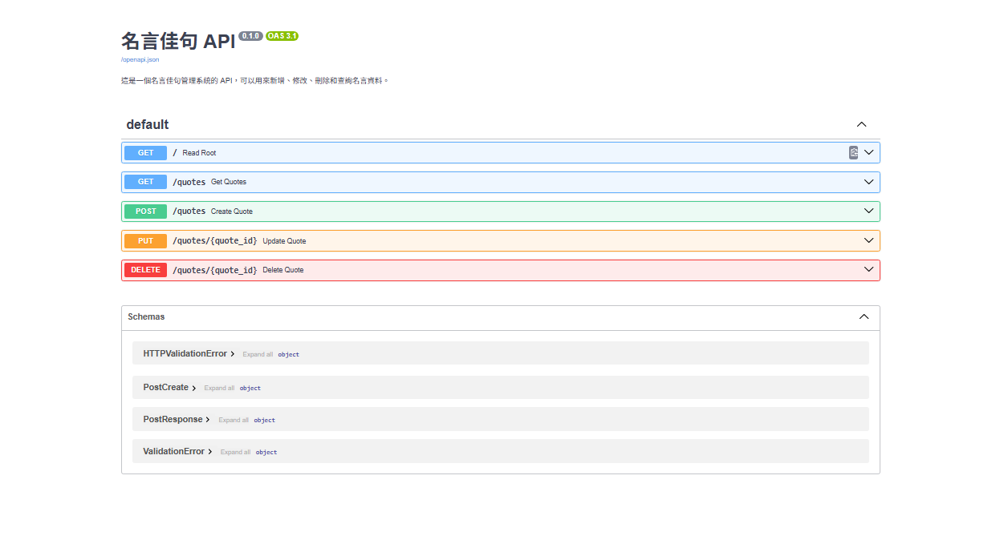
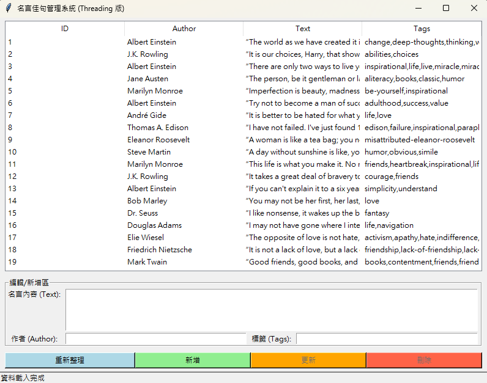

# 名言佳句管理系統 (Quote Management System)

這是一個結合動態爬蟲、後端 API 與圖形介面的全端整合專案。

## 🛠 系統架構
1. **一：動態爬蟲 (pacho.py)**: 使用 Selenium 模擬 Chrome 瀏覽器操作，抓取動態網頁資料並存入 SQLite。
2. **二：後端 API (api.py)**: 基於 FastAPI 框架開發，提供 RESTful 風格的資料 CRUD 介面。
3. **三：管理介面 (gui.py)**: 使用 Tkinter 實作，並透過多執行緒技術確保不卡頓。

---

##  截圖

### 1. 後端 API 文件 (Swagger UI)
展示系統提供的所有 API 端點（GET, POST, PUT, DELETE）。

> **步驟1**：開啟 `http://127.0.0.1:8000/docs` 後的完整畫面，會看到「名言佳句 API」標題。

### 2. GUI 視窗運作
展示圖形介面成功載入資料庫內容，並呈現多執行緒穩定的操作環境。

> **步驟3**：啟動 `gui.py` 後，表格內顯示多筆名言，且底部狀態列顯示「資料載入完成」的畫面。

---

## 執行步驟與功能說明

### 第一步：動態爬蟲 (pacho.py)
* **執行指令**: `python pacho.py`
* **功能**: 
    * 使用 Selenium Chrome Headless 模式。
    * 模擬點擊「Next」按鈕自動爬取前 5 頁。
    * 儲存 `text`, `author`, `tags` (逗號分隔字串) 至 `quotes.db(資料庫資料)`;一開始檔案無`quotes.db`，需先執行`pacho.py`才會產生。

### 第二步：後端 API 服務 (api.py)
* **執行指令**: `uvicorn api:app --reload`
* **功能**:
    * **GET /quotes**: 取得所有名言列表。
    * **POST /quotes**: 新增名言，含 Pydantic 資料驗證。
    * **PUT /quotes/{id}**: 根據 ID 修改現有名言內容。
    * **DELETE /quotes/{id}**: 根據 ID 刪除名言。

### 第三步：管理視窗程式 (gui.py)
* **執行指令**: `python gui.py`
* **功能**:
    * **Treeview 顯示**: 展示資料庫內的編號、作者、名言與標籤。
    * **多執行緒 (Threading)**: 點擊「重新整理」或「新增」時，API 請求在後台執行，視窗不卡死。
    * **編輯**: 點擊表格項目，資料自動填入下方輸入框供修改或刪除。

---

## 必要套件 (requirements.txt)
* `selenium` (爬蟲驅動)
* `fastapi` (後端框架)
* `uvicorn` (伺服器執行)
* `requests` (前端通訊)
* `sqlite3` (資料庫儲存)

---